# 👋 Hi there, I'm **Akinola Samuel Afolabi**

<div align="center">


</div>


## 🚀 **About Me**

```python
class SamuelAfolabi:
    def __init__(self):
        self.name = "Akinola Samuel Afolabi"
        self.roles = ["AI Engineer", "Data Scientist", "ML Engineer", "Biostatistician"]
        self.passion = "Transforming data into intelligence with AI, NLP, LLMs & Computer Vision"
        self.expertise = {
            "ai_ml": ["Computer Vision", "Transformers", "LLMs", "NLP", "RAG"],
            "cloud": ["Google Cloud Platform", "Microsoft Azure"],
            "focus": ["MLOps", "Deep Learning", "Biostatistics", "Data Analytics"]
        }
    
    def get_current_status(self):
        return "Always exploring cutting-edge AI innovations 🧠"
```


## 🛠️ **Technology Arsenal**

<div align="center">

### **Programming Languages**


### **AI/ML Frameworks & Libraries**


### **Data Science & Analytics**


### **Cloud & DevOps**


### **Databases**


</div>


## 🎯 **Expertise Areas**

<div align="center">

| 🤖 **Artificial Intelligence** | 📊 **Data Science** | ☁️ **Cloud Computing** | 🔬 **Biostatistics** |
|:---:|:---:|:---:|:---:|
| Computer Vision | Statistical Analysis | GCP Architecture | Clinical Data Trials and Analytics|
| Natural Language Processing | Data Visualization | Azure ML Services | Epidemiological Studies |
| Large Language Models | Predictive Modeling | MLOps Pipelines | Biomedical Research |
| Transformer Architectures | Feature Engineering | Cloud Deployment | Statistical Inference |
| RAG Systems | Time Series Analysis | Containerization | Survival Analysis |

</div>

## 🚀 **Featured Projects**

<div align="center">

| Project | Description | Tech Stack |
|---------|-------------|------------|
| 🚀 **[RepoPilot – AI GitHub Assistant](https://github.com/Eniiifeoluwa/RepoPilot)** | AI-powered GitHub workflow automation that analyzes, summarizes, and labels issues & pull requests | `Python` `FastAPI` `SQLite` `GitHub Actions` `Hugging Face` |
| 👁️ **[Dermatologist Anike](https://dermatologist-anike.streamlit.app/)** |AI-powered Skin Disease detection | `PyTorch` `OpenCV` `Streamlit` `FastAPI` `CI/CD` `EfficientNet` |
| 📊 **[GlucoSight](https://olamidipupo.shinyapps.io/glucosight)** | Diabetes anomalies detection, dashboard, and Prediction Web App | `R Programming` `R Shiny` `Plotly` `ggplot` `Python` |
| 🤖 **[Calmi - AI Mental Health Companion](https://mentalcalmi.streamlit.app)** | AI Powered Mental Health Assistant, finetuned on Gemma-3-270M | `Transformers` `PyTorch` `PEFT` `Streamlit` |
| 📈 **[MLOps Production Pipeline](#)** | Scalable ML model deployment and monitoring | `MLflow` `Docker` `Kubernetes` `GCP` |

</div>


## 📊 **GitHub Analytics**

<div align="center">


</div>

<div align="center">


</div>

## 🏆 **GitHub Trophies**

<div align="center">

[](https://github.com/ryo-ma/github-profile-trophy)


</div>


## 🌐 **Connect With Me**

<div align="center">

[](https://linkedin.com/in/akinola-afolabi)
[](mailto:akinolaayomide226@gmail.com)
[-000000?style=for-the-badge&logo=twitter&logoColor=white)](https://x.com/Oluwaagbemileke?s=09)

<!--[](https://YOUR_PORTFOLIO.com) -->

</div>

## 💭 **Quote**

<div align="center">

> *"If you torture your Data long enough, it will confess to anything."* 
> 
> — **Ronald Coase**

</div>


## 🎯 **Current Focus**

```mermaid
graph TD
    A[🎯 Current Focus] --> B[🤖 Advanced LLM Research]
    A --> C[🔬 Biostatistical AI Applications]
    A --> D[☁️ MLOps & Cloud Architecture]
    A --> E[👁️ Computer Vision Innovation]
    
    B --> B1[Fine-tuning Transformer Models]
    B --> B2[RAG System Optimization]
    
    C --> C1[Clinical Data Analysis]
    C --> C2[Epidemiological Modeling]
    
    D --> D1[Kubernetes Deployment]
    D --> D2[CI/CD Pipelines]
    
    E --> E1[Real-time Object Detection]
    E --> E2[Medical Image Analysis]
```



<div align="center">

**⭐ Star my repositories if you find them interesting!**


</div>

---

<div align="center">

*"Building the future, one algorithm at a time."* 🚀


</div>
